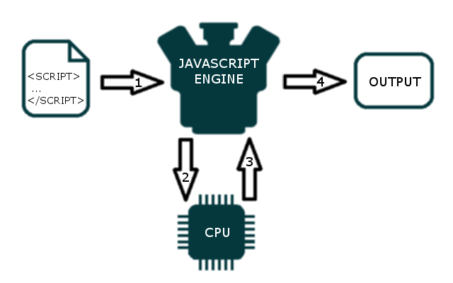

### 前言
不管你是JavaScript新手，还是已经有JavaScript的开发经验，想对JavaScript的执行机制作更多的了解，却不知道先要掌握哪些必要知识块才能下手，那么这篇文章再适合不过了，准备好了就泡上一杯咖啡，找一个安静的环境开始今天的学习吧！！！

#### 涉及的知识块
* JavaScript引擎
* JavaScript的运行环境(Runtime)
* 进程与线程
* JavaScript的执行是单线程的
* Event loop
### JavaScript 引擎是什么
想必，大家在学习JS语言时，首先进入头脑的便是：**JS是一门解释型的高级编程语言**，这意味着源代码不需要优先编译成二进制代码在执行，那么问题来了？计算机只懂机器代码 0 和 1，那么不编译JS代码，计算机如何才能理解它呢？

这就是JS引擎的工作了。**JS引擎是一个程序，它负责将JS源代码翻译成计算机能识别的二进制代码，并且通过CPU来执行翻译后的结果。**

>JS引擎就好比一个容器，它里面装着你运行的程序代码，下面引用一张图片来加强理解

*简单解释上图：JS代码被JS引擎解释成二进制代码，经CPU进行计算并返回结果给JS引擎，接着引擎拿到结果后输出*

>编写JS代码我们不需要另外安装额外的软件来编译JS代码，因为我们的JS代码通常都是在浏览器中执行的，而浏览器中就提供了JS引擎，它专门负责解释执行JS代码

这里我们简单的介绍了JS引擎，下面是几种最为重要的JS引擎名称

* Chrome的V8引擎 - 它由C++编写，用于Google浏览器，Opera，NodeJs
* SpiderMonkey - 也是由C++编写，用于火狐浏览器
* Nitro - 由Apple自主研发，用于Safari浏览器
* Chakra - 由Microsoft研发，用于Edge浏览器

*JS引擎只是一个更大概念的构建块，它涉及到许多的概念，下面我们说说它的工作环境，也就是JS的运行环境，英文叫Runtime*

### JavaScript的运行环境

在web开发时，我们通常不必直接使用引擎。JS引擎是在某一环境中工作的，该环境分为浏览器环境和NodeJs环境，这个环境给你的脚本提供了在运行期时可以使用的额外功能，那么这些**功能**指的是什么呢？

想想看，我们可以在script脚本下用DOM提供给我们的API来对网页进行操控，而这些DOM API便是上面所说的**功能之一**，它们可以是**一些实用工具库或者API，利用它们可以很好的与外界进行沟通。**

例如： 我们可以利用DOM提供的鼠标事件来监听用户的点击，用户点击后，执行我们设定的回调函数，做出某种反应，以此达到与网页的沟通

>JavaScript代码通常是在浏览器环境或NodeJS环境中运行的，因为它们都提供了V8引擎，来解释执行JS代码，不同在于二者运行环境提供的功能不同，换而言之，就是**浏览器环境下，提供了window，DOM..** JS脚本可以使用它们来与浏览器打交道，**而NodeJs环境下，提供了require...给你使用.**

我们举例来理清下JS代码，JS引擎和JS Runtime的关系
想象下一个机器人要去灭火：

1. JS代码就好比机器人去灭火看的说明书
2. JS引擎就好比能看懂说明书以及去灭火的机器人
3. JS Runtime就好比提供给机器人灭火的水枪，消防车等等工具 

*由于JS Runtime太过抽象，这里就直接利用了环境所能提供的工具来进行举例解释Runtime了*

### 进程与线程
*在继续讲解JS单线程时，有必要提前了解操作系统中的进程与线程，由于它们太过抽象了，这里就简单举例的理清下它们，来自材料[Process and Thread](http://www.qnx.com/developers/docs/6.4.1/neutrino/getting_started/s1_procs.html)*

**进程好比一座房子**

房子实际上是一个容器，它拥有特定的属性(占地面积，多个房间，厕所等等)

这么看来，房子它就是一个静态的容器，它不会自发的做任何事 —— 它是一个被动的对象，这实际上就是 **进程的样子**

**线程好比房子的占有者**

居住在房子里的人是主动对象(active object) —— 他们使用着房子里的资源，看电视，做饭，淋浴......

**单线程**

对于刚毕业的大学生来说，我们往往会独自在外租房，你可以随时使用房子里的一切资源，因为只有你一个人。

要是你正在洗澡，而想起还没有拖地，这时你就必须洗完澡，然后才能去拖地。单线程在执行程序或说在执行任务时，同一时刻只能做一样事，只有当前的事情做完了(程序|任务执行完了)，才能继续

**多线程**

倘若你谈了个女朋友，你们开始了同居生活，那么现在房子里的资源就由你们两个人共享了，你也不能随时使用卫生间进行淋浴了，你要用卫生间的话，首先你得看看里面有没有人在使用，若是有人，你就得等着，直到她出来你才可以使用卫生间，这里涉及到了[互斥锁](http://www.qnx.com/developers/docs/6.4.1/neutrino/getting_started/s1_procs.html)，这里不过多解释，可自行了解

不过要是你在洗澡，想起没有拖地，那么你可以让你的女朋友去拖地，这样同一时刻便可以完成多个任务了。

* 单线程可以随时使用内存空间的资源，不过在同一时刻却只能做一件事，做完之后才可以继续做其他事情

* 多线程在使用内存空间的资源时会受到限制，不过在同一时刻可以完成多项事情

**让我们回到进程和线程**

房子占有一块面积来放置物体，同样的，进程也需要一块内存空间来分配资源。
房子里的人可以共享房子里的资源，如电视，电脑... 也就是说**线程共享着进程内的资源**，若是你出去买了几桶爆米花回来，那么房子里的其他成员都可以一起享用，也就是说，一个线程分配了某物，其他线程也可以立即享用，因为它们都是在同一个地址空间里——房子，同样地，要是进程分配了内存，那么这块新的内存对进程里的所有线程可用，除非有特殊情况。

>通过上面的例子可以得出，进程是包含线程的，进程占有内存空间，该空间里分配了资源，一般情况下，进程里的所有线程可以共享该内存空间的资源

*了解了进程与线程的基本面后，我们继续*

#### JavaScript的执行是单线程的嘛？

你们应该都听过JavaScript语言是在一个线程中执行的，这句话没错，不过不完全正确，我们应该要理解单线程对于JavaScript语言意味着什么？

的确，你的JS代码是在一个线程里执行的。不过，这可不意味着整个JS运行环境在一个线程里运转的，实际上，JS运行环境中有多条线程协同工作着，我们不必担心线程的管理，因为JS运行环境帮我们做了

**不过，它是怎么做的呢？**

JS运行环境怎么知道什么时候该执行你写的JS代码呢？要是只有一条线程负责执行JS代码，那么必然有某种机制管理着JS代码执行的次序，不然可不乱套了
**这种机制被称为[Event loop](https://developer.mozilla.org/en-US/docs/Web/JavaScript/EventLoop)**

### JavaScript的Event loop是什么呢？
在阐述之前，我们首先应该知道一个十分重要的细节。**所有编写的JS脚本分为两大类**

* 第一大类由**立即调用脚本**组成。一旦这类JS脚本加载完成，运行环境则将它们传递给JS引擎去执行。在web开发中，这类脚本通常是浏览器加载完一个web页面后调用的初始化脚本，也就是script标签内的JS代码

* * *

* 第二大类就是所谓的**事件回调函数**。一个事件回调函数包含了代码块，这部分代码等着**事件**的触发才会执行。在web中，鼠标的点击或网络请求的返回都是触发了对应的事件

**Evenet loop**是JS 运行环境的一部分，它负责**处理回调函数**

当你创建一个回调函数，这个回调函数必然与一个特定的事件相关联。当该事件触发时，运行环境则将对应的回调函数放到一个**事件处理队列Event queues**中，Event loop持续不断地监听着该队列，并且按照它们抵达地时间依次执行。

**重点来了**

回调函数总是完全执行地。**Event loop**每次执行一个回调函数，队列里的所有回调函数都得等到当前回调函数的执行完成

要是一个回调函数执行时间太久，它便阻塞了其他回调函数。所以说**回调函数里的代码应该相对简单而短小**

>上面说到了Event loop执行回调函数，其实不是的，是当运行JS的主线程闲置时，Event loop会将事件处理队列中排第一位的回调函数推到主线程去执行，我们先牢记这点

>上面只是简单的介绍了Event loop，后面会单独用一篇文章来将它和JS的执行机制如何相配合的

### 浏览器提供给JS的运行环境
>上面简单的说到了JS的运行环境主要有两种，现在来说说浏览器提供给JS的运行环境，JS的诞生主要原因便是与网页进行交互，通过JS向由HTML和CSS创建的网页中添加一些动态效果。

那么如何进行这种互动呢？浏览器环境便提供了DOM API，在浏览器环境下运行的JS就可以使用这些API修改静态页面

web浏览器实际上是web页面的交互窗口。**用户点击**网页上的元素，**滚动**页面，**用键盘打字**等等。所有这些**操作都会触发用户事件**，这些事件是由浏览器暴露的，且作为了JS运行环境的一部分

当然，浏览器环境除了提供DOM API，用户事件，你也可以自定义事件

还没完，浏览器还提供了定时器事件，也就是SetTimeout，SetInterval，用以延迟执行某段代码，以及用于与服务器进行交互的ajax对象，**网络请求返回的结果也是一个事件**

>*总结来说，在浏览器下运行的JS，可以使用浏览器环境提供的WebAPIs(DOM AJAX SetTimeout...)来与网页进行交互以及与服务器进行数据交互*

### JS引擎 VS JS运行环境
最后，我们再来总结一番二者的区别。

* **JS引擎**将你的JS代码翻译成可执行的机器代码指令，以便能够被CPU执行。**其实并不是JS引擎来执行代码的，而是CPU来执行的，不过我们通常简化说成了JS引擎解释执行JS脚本代码**，引擎在运行期时动态的翻译脚本代码，也就是通常说的边解释边执行了，若是没有执行你的代码，则它是不会被编译的。
* **
* JS执行环境给你的JS脚本提供了实用性的工具库 | API，以便代码在执行期间使用。只是你的脚本代码会去引用这些库或API，而JS引擎本身不依赖它们

>JS引擎是完全独立于运行环境的，就比如说，V8引擎既存在于NodeJs环境中，也可以在浏览器环境

### 总结
首先，我们简单介绍了JS引擎，让我们以此为基础开始JS运行环境的讲解，了解到JS运行环境的一些功能，接着提及了Event loop，Events，Events queue，最后在对比总结了JS Runtime 和JS Engine，有了这些基本知识块，下面笔者将另外总结一篇文章带你全面了解**JS的执行机制**

### 参考链接
* [The JavaScript runtime environment](http://dolszewski.com/javascript/javascript-runtime-environment)
* [process and thread](
http://www.qnx.com/developers/docs/6.4.1/neutrino/getting_started/s1_procs.html)
* [How JavaScript works](
https://blog.sessionstack.com/how-does-javascript-actually-work-part-1-b0bacc073cf)

