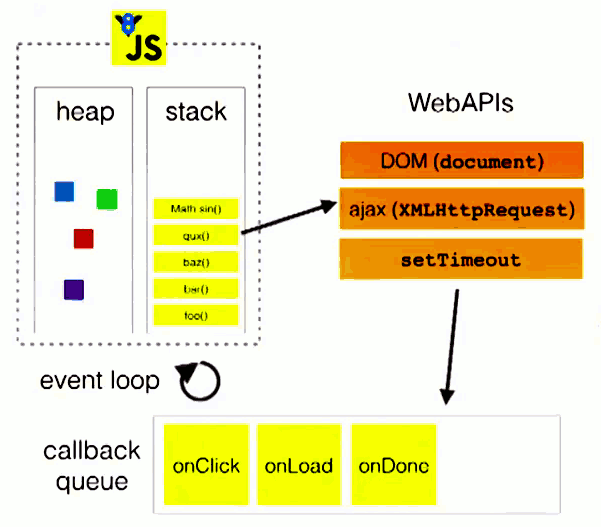

 #### 前言
接着上篇对JS运行环境的了解之后，本文将展开对JS执行机制的讲解，篇幅较长，涉及的知识块较为深入，建议读者一定要耐心阅读，毕竟这是理论知识，可能会觉得有些乏味，不过，当你弄明白JS的执行机制之后，你会成就感倍升的，以后学习其他难点都不在话下了，那么就开始今天的学习咯

#### 纲要
* 同步和异步
* macrotask和microtask
* Event loop
* call stack
#### 同步和异步
前文已经说了JS的执行是单线程的，也就是同一时刻只能做一件事情，做完当前事情才能继续往下做，放在这里就是说，程序在执行的时候，若是当前在执行ajax，它正在请求网络数据，由于网速原因，请求时间较长，那么程序就会停下来，等待结果返回才会往下执行，这显然不理想，用户可不喜欢等待啊，所以就出现了**异步任务**，刚刚我们说的ajax其实就是**异步任务**，而JS的任务分为**同步与异步**

*同步任务直接在主线程上按照先后次序执行，排队执行，如：页面的初始化渲染，script标签内的JS代码的首次执行......*

*异步任务则被放入**task queue**（任务队列），ajax网络请求，DOM事件，定时器事件......*

前面说的同步任务与异步任务到底指的是什么呢？
其实很简单的，从JS代码层面看，**任务就是要执行的代码**

**在JS代码中**

*同步任务指的是script标签内要执行的代码......*

*异步任务指的是发送网络请求，定时器事件，DOM事件......比较耗时耗力*

#### 从同步与异步看待Event loop
Event loop是事件循环，它是JS执行环境所实现的一种机制，当JS执行环境识别出异步任务后，该环境中会有专门的模块去执行该异步任务，只有当异步任务有了结果后，则将其**关联的回调函数放到一个事件处理队列中——Event handler queues（或者说另外一种解释，如下:PS）**，当主线程中的同步任务全部完成后，event loop机制就会将事件处理队列中最先抵达的回调函数推入主线程去执行，上述过程不断循环便构成了**事件循环机制**，由此可见event loop就是用来处理异步任务的，它便是JS异步机制的实现

>**PS: 来自[MDN](https://developer.mozilla.org/en-US/docs/Web/JavaScript/EventLoop)**
>我们可以这么理解：在web浏览器中，当异步任务有了结果（某个事件被触发时，如点击事件），则往**任务队列（又称消息队列）** 中添加一个 **消息（又称事件）**，该消息附带着一个事件监听器（又称事件在定义时所关联的回调函数），接着在event loop期间的某个时刻（即主线程闲置时），event loop开始处理消息队列中排在第一位的消息，该消息从消息队列中被移除，同时将该消息作为输入参数来调用它所关联的回调函数（或说推入主线程去执行）

*上面说到会有专门的模块去执行异步任务，其实JS Runtime中还有一些线程来执行特定的异步的任务，由于线程不好理解，这里说模块应该好受些（如：定时器事件模块负责执行定时器事件，依据设定的延迟时间，判断该异步任务是否有结果），还记得我们在JS Runtime中提到了，JS执行环境可不是多线程的，而我们不需要去关心这些线程的工作，统统说成JS Runtime 会去执行异步任务好了*

>

>下面来段代码解释一番

```
console.log('global script');
setTimeout(() => {
    console.log('setTimeout')
}, 1000)
```

1. 全局代码(chrome中显示anonymous)被压入调用栈执行
2. 执行console.log('global script') 打印 global script
3. setTimeout事件为异步任务，交给运行环境处理，继续往下执行代码
4. 这时主线程的代码执行完了，则event loop检查事件处理队列中是否有回调函数，由于上面代码执行速度飞快，1000ms还没有到，所以队列为空
5. 等待1000ms（其实等待的时间<1000ms）后任务有结果了，则其关联的调函数进入event handler queues，这时event loop将其推入主线程执行，打印setTimeout

>看下面的click事件示例
```
 <button id="btn">click me</button>
    <script>
        let btn = document.getElementById('btn');
        btn.onclick = function () {
            console.log('click');
        }
        var ms = Date.now()
        for (var i = 0; i < 1000000000; i++) {
            if (i == 999999999) {
                console.log(Date.now() - ms + 'ms')
            }
        }
    </script>

```
1. 首先执行script全局代码，获取btn元素
2. 接着发现给btn绑定了click事件，是异步任务，其交给JS Runtime处理，它会监听该任务的执行，即为：用户是否点击btn按钮元素
3. 接着执行下面代码，循环10亿次，根据电脑配置不同耗费的时间也不同，我测试的时间为4462ms，在这4462ms内主线程一直在忙活（浏览器窗口一直转圈圈），而4462ms内若是你点击了btn元素，则该异步任务有结果了，其回调函数被放入事件处理队列中
4. 4462ms时间终于到了，打印 4462ms，这时主线程闲置了，event loop则将事件处理队列中click事件关联的回调函数推入主线程去执行，打印 click，你会发现并不是说**一触发click事件，它关联的回调函数立马会执行**

>可能有些小伙伴迷惑了，上面提到的调用栈(call stack)是什么？
>这里不作过多解释，简单来说说：

>记住：JS引擎有一个heap（堆，不过多解释）和一个单一的call stack 

*call stack是一种使用**后进先出原则**而实现的一种数据结构，在JS中，它有两个作用，一是函数上下文的存放，二是管理函数的调用（或说记录程序当前执行的位置）*

*我们知道函数在调用时，首先创建一个函数执行上下文，该上下文就被压入call stack（又叫Execution Context Stack）顶部，接着执行该函数内的代码片段（JS引擎每次都执行位于call stack顶部的执行上下文对应的函数内的代码片段），函数执行完后，销毁它的执行上下文，代码控制流（code control flow）返回到上一个执行上下文（或说一直处于call stack顶部），执行该上下文对应的函数内的代码片段*

*而全局代码整体看成 位于一个anonymous(chrome中显示为anonymous)函数中，它对应一个Gobal Execution Context，默认位于call stack栈底*

*当call stack为空时，表示JS引擎已经执行完全局执行上下文对应的anonymous函数内的代码了，该上下文退栈，则表示JS引擎（或主线程）处于闲置，此时才会轮到event loop登场*

>下面是call stack与event loop的关系图：




>到这里应该对event loop事件循环机制清楚了吧
#### macrotask和microtask
>上面我们说到的异步任务其实被细分为两部分
>* microtask
>* task（又叫macrotask）

*多个macrotask任务便构成了一个macrotask队列*

*多个microtask任务便构成了一个microtask队列*

>macrotask队列由指定的macrotask sources提供，而任务源非常广泛
>可参考[Generic task sources](
https://html.spec.whatwg.org/multipage/webappapis.html#task-source)

*总结来说：*
* macrotask任务源：
   包含整体的JS代码，事件回调(click事件)，XHR回调（ajax的onload），定时器(setTimeout,setInterval,setImmediate)，UI render

**一个event loop有一个或多个macrotask队列**

* microtask任务源：
process.nextTick,promise.then回调,Object.observe,MutationObserver

**一个event loop还有一个microtask队列**

>microtask被推入microtask队列，macrotask被推入macrotask队列

#### 深入event loop循环过程
现在我们将JS中的异步任务分成了microtask和macrotask，请看下图：


简单总结起来，一次完整的事件循环(event loop)步骤如下：

>1. 检查macrotask队列是否为空，为空则看3，否则看2
>2. 执行macrotask队列中的一个任务
>3. 继续看microtask队列是否为空，为空则看5，否则看4
>4. 执行microtask队列中的一个任务，执行完成后返回步骤3
>5. 执行一次视图更新

来段代码：
```
  <script>
        console.log('start')
        setTimeout(() => {
            console.log('setTimeout')
        }, 2000)
        new Promise(function(suc) {
            console.log('promise')
            suc('then1')
        }).then((val) => {
            console.log(val)
            return 'then2'
        }).then((val) => {
            console.log(val)
        })
        console.log('end')
        // start
        // promise
        // end
        // then1
        // then2
        // setTimeout
    </script>

```
* 首先全局script代码作为macrotask进入主线程执行，打印start
* setTimeout事件为macrotask，当该事件有结果后（2000ms后），它的回调函数放入macrotask任务队列
* 继续往下执行代码，new Promise立即执行，打印promise
* .then(...)为microtask，其回调函数放入microtask任务队列
* 接着打印end

> 现在主线程的任务为空了，到event loop登场了，开始第一轮事件循环
* 检查microtask队列，发现then回调函数，执行该任务，打印then1，由于then回调函数返回'then2'，promise的状态为fullfill，接下来的then回调继续被推入microtask队列
* event loop继续执行microtask队列里的任务，直到该队列为空
* 这样第一次事件循环结束，主线程可能会去做一些UI渲染
* 接着第二次事件循环，执行macrotask队列的任务，执行setTimeout回调，2000ms后打印setTimeout
* 这样的循环操作，也是**事件循环机制**
>而这种事件循环机制便构成了JS的执行机制，它与上面我们所的异步任务里的事件循环是一样的，只不过这里将异步任务细分了，从而构成了JS强大的异步编程

#### 总结
若是读到了这里，笔者感到十分开心，因为笔者也是花了大量的时间和精力，我们最后再来理清以下今天的知识块。

我们先是了解了JS的单线程特性，从而引出了同步任务和异步任务，接着由异步任务慢慢深入到了event loop机制，而在理清event loop的过程中，我们了解到了消息队列，简单描述了异步任务的执行是由JS Runtime负责的，从而使得JS引擎可以继续执行下面代码，接着说到了call stack，了解它便知道了主线程闲置的时刻，最后将异步任务细分为macrotask和microtask再次围绕event loop进行介绍

>最后的最后，十分乐意接受大家对本文错误地方的指出与意见，因为本文的编写也是参考了大量的文章，再结合自己的理解，最后完成的。

#### 参考链接
* [这一次彻底弄懂JS执行机制](https://juejin.im/post/59e85eebf265da430d571f89)
* [深入理解js事件循环机制](http://lynnelv.github.io/js-event-loop-browser)
* [event loop规范](https://github.com/aooy/blog/issues/5)
* [tasks-microtasks-queues-and-schedules](https://jakearchibald.com/2015/tasks-microtasks-queues-and-schedules/)
* [JS执行机制的全面梳理](https://www.cnblogs.com/dailc/p/8325991.html)
* [阮大神讲解event loop](http://www.ruanyifeng.com/blog/2014/10/event-loop.html)
* [详解JavaScript中的Event Loop机制](https://zhuanlan.zhihu.com/p/33058983)
* [javascript-call-stack](https://www.freecodecamp.org/news/understanding-the-javascript-call-stack-861e41ae61d4/)
